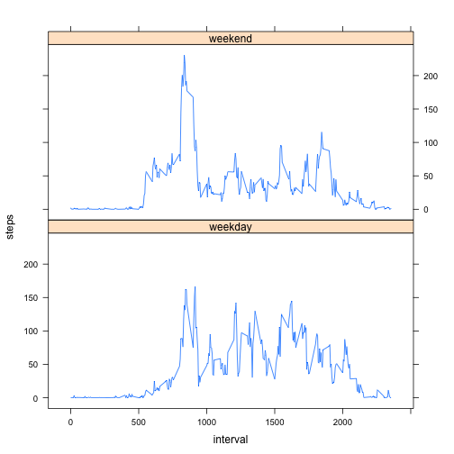

# Reproducible Research: Peer Assessment 1
# Author: James McGuigan

## Loading and preprocessing the data

The activity data is stored in activity.csv, with 3 fields: steps, date, interval

```r
data <- read.csv("activity.csv", colClasses=c("integer","Date","integer"));
summary(data)
```

```
##      steps            date               interval   
##  Min.   :  0.0   Min.   :2012-10-01   Min.   :   0  
##  1st Qu.:  0.0   1st Qu.:2012-10-16   1st Qu.: 589  
##  Median :  0.0   Median :2012-10-31   Median :1178  
##  Mean   : 37.4   Mean   :2012-10-31   Mean   :1178  
##  3rd Qu.: 12.0   3rd Qu.:2012-11-15   3rd Qu.:1766  
##  Max.   :806.0   Max.   :2012-11-30   Max.   :2355  
##  NA's   :2304
```

## What is mean total number of steps taken per day?

The data records the number of steps taken in each 5 minute interval, but this can be combined for daily stats:

```r
steps.per.day <- sapply( split(data, data$date), function(data) { sum(data$steps,    na.rm=TRUE) })
summary(steps.per.day)
```

```
##    Min. 1st Qu.  Median    Mean 3rd Qu.    Max. 
##       0    6780   10400    9350   12800   21200
```

The mean number of steps per day is 9354, and the median is 10400, with a histogram of the distrabution shown below:

```r
hist(steps.per.day, xlab="Steps per day", main="Histogram of steps per day")
```

 

## What is the average daily activity pattern?

The daily pattern, averaged over each 5 minute pattern shows:

```r
daily.pattern <- sapply( split(data, data$interval), function(data) { mean(data$steps, na.rm=TRUE) })
plot(names(daily.pattern), daily.pattern, type="l")
```

 

The interval with the greatest activity is in minutes 835-839, with a mean of 206 steps:

```r
str(daily.pattern[ order(daily.pattern, decreasing=TRUE)[1] ])
```

```
##  Named num 206
##  - attr(*, "names")= chr "835"
```

## Inputing missing values

The number of missing values from the dataset is 2304, comprising 13% of readings:

```r
sum(is.na(data$steps))
```

```
## [1] 2304
```

```r
sum(is.na(data$steps))/length(data$steps)
```

```
## [1] 0.1311
```

Missing data can be filled using the average reading from the daily pattern:

```r
data.filled <- data
data.filled[is.na(data.filled$steps),]$steps <- daily.pattern[as.character(data[is.na(data$steps),]$interval)]
```

The median steps per day, will assumed NA values, has increased by 3% to 10770, whilst the mean has increased by 15% also to 10770.

```r
steps.per.day.filled <- sapply( split(data.filled, data.filled$date), function(data.filled) { sum(data.filled$steps, na.rm=TRUE) })
summary(steps.per.day)
```

```
##    Min. 1st Qu.  Median    Mean 3rd Qu.    Max. 
##       0    6780   10400    9350   12800   21200
```

```r
summary(steps.per.day.filled)
```

```
##    Min. 1st Qu.  Median    Mean 3rd Qu.    Max. 
##      41    9820   10800   10800   12800   21200
```

```r
paste("median: +", as.integer( median(steps.per.day.filled)/median(steps.per.day) * 100 - 100), "%", sep="")
```

```
## [1] "median: +3%"
```

```r
paste("mean:   +", as.integer(   mean(steps.per.day.filled)/mean(steps.per.day)   * 100 - 100), "%", sep="")
```

```
## [1] "mean:   +15%"
```

The impact of filling in missing values is to remove the large tail spike for low number of daily steps and create a more normal distrabution.

```r
hist(steps.per.day.filled, ylim=c(0,40), xlab="Steps per day", main="Histogram of steps per day using assumed NA values")
```

 


## Are there differences in activity patterns between weekdays and weekends?

The difference in the daily activity patterns can be seen in the following histogram, with a larger spike possibly representing the contribution of weekend morning joggers, followed by a slightly more sedentry day overall.  

```r
library("lattice")
data.filled$weekday <- weekdays(data.filled$date)
data.filled$weekend <- ifelse( data.filled$weekday %in% c("Saturday","Sunday"), "weekday", "weekend" )

week.pattern <- data.frame(sapply( split(data.filled, data.filled$weekend), function(subset.weekend) {
    sapply( split(subset.weekend, subset.weekend$interval), function(subset.interval) {
      mean(subset.interval$steps, na.rm=FALSE)
    })
}))

week.table <- do.call( "rbind", 
  lapply( colnames(week.pattern), function(name) {
    frame <- data.frame(
      interval = as.numeric(rownames(week.pattern[name])),
      steps    = week.pattern[name],
      weekend  = name
    )
    colnames(frame) <- c("interval", "steps", "weekend")
    frame
  })
)

xyplot(steps ~ interval | weekend, week.table, type="l", layout=(c(1,2)))
```

 
